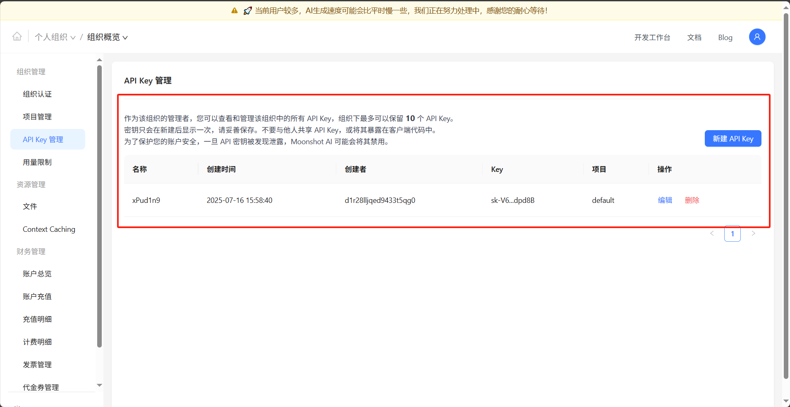
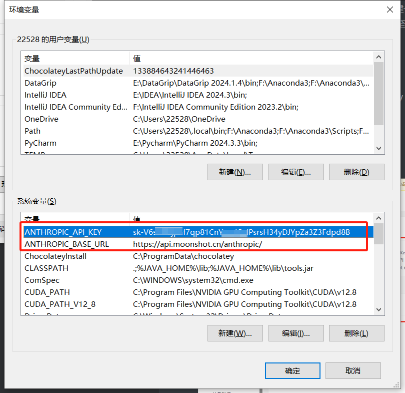
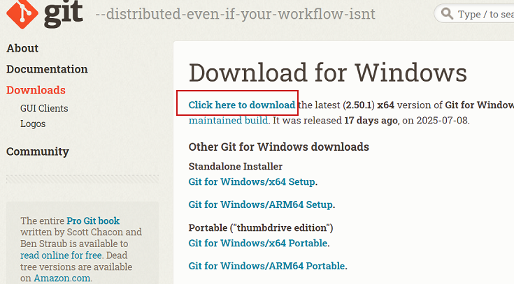
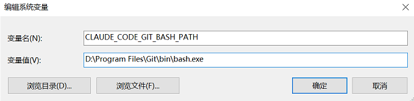
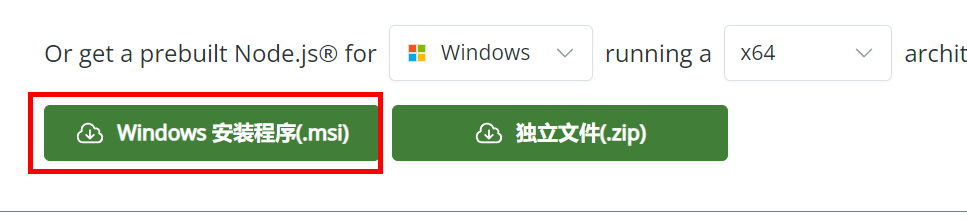
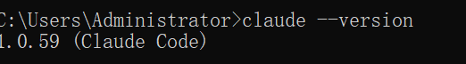
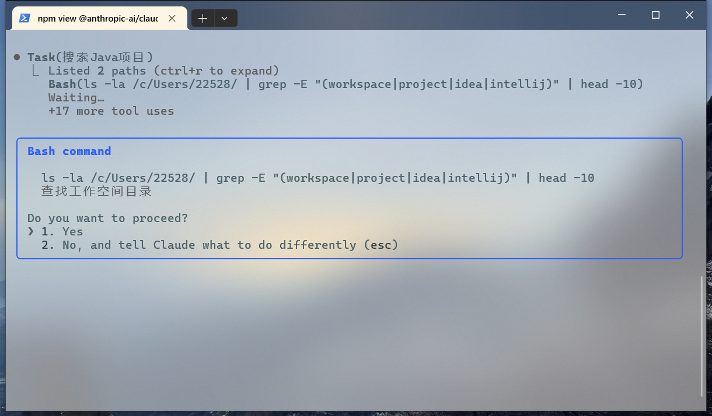

# Claude Code

## 第一章 引言

### 1.1 为什么不用Cursor了

​	Cursor是一款基于人工智能的代码编辑器，旨在帮助开发人员编写代码，并于AI进行实时互动，提供写代码建议、错误检测和自动补全功能。支持多种编程语言（如Python、JavaScript、Java等）

​	现在AI开发工具在开发中的能力和重要性越来越高，Cursor的高能力让很多人趋之若鹜，但是Cursor计价规则的**黑箱模式**、朝令夕改、费用上调又让开发者们感到无奈且遗憾。

​	Cursor首先是修改了免费用户的使用权限，从不限制模型到只能使用gpt4.1模型，再到只能使用Auto模式；其次修改了每个月充值了 20美元的Pro用户的权限，首先是从每月500次快速，额度用尽后转为慢速，变成了无次数限制，但是快速慢速混用，可以通过额外付费避免慢速。其实这倒是也能接受，无非是每天可能会有几个任务卡住几分钟或者十几分钟而已。但是最近一次的计费规则修改堪称抽象，Pro用户每月只能发起总价$20的请求。下图是我上个月的用量：


​	原来这些模型这么贵。那$20想必也是稍纵即逝。这种朝令夕改、不公布计价细节的行为让人无法接受，Cursor是其母公司的唯一产品，其并没有一线大厂的一言九鼎和尊重用户的品质，因此，选择一个合适的替代品十分重要

### 1.2 为什么使用Claude Code

​	Calude（克劳德）Code 是由 Anthropic 开发的官方 CLI 工具，用于协助用户处理软件工程任务。 Anthropic 发现了Cursor的成功后，开发了Claude Code作为Cursor的竞品。Claude Code是一个革命性的AI编程工具，它将强大的Claude AI直接集成到您的开发环境中。

```
Anthropic是一家位于美国加州旧金山的人工智能股份有限公司，成立于2021年。该公司是一家人工智能安全和研究公司，致力于构建可靠、可解释和可操纵的AI系统。Anthropic公司开发了聊天机器人Claude，提出的“宪法AI原则”。 
2025年2月25日，Anthropic宣布推出Claude 3.7 Sonnet，称这是其迄今为止最智能的模型，也是市场上首款混合推理模型。北京时间2025年5月23日，Anthropic正式推出Claude 4系列大模型。
2025年4月，入选《2025福布斯AI 50榜单》
```

与传统的代码编辑器插件不同，Claude Code在终端中运行，具有以下特点：

* 智能代码理解: 深度理解您的项目结构和代码逻辑
* 自然语言交互: 用普通话描述需求，AI自动执行编程任务
* 全项目上下文: 理解整个代码库的架构和依赖关系
* 安全可靠: 直接连接Anthropic API，所有操作在本地执行
* Git集成: 智能的版本控制操作和历史分析

除此之外，Claude Code还有以下优势：

- 原生Claude模型，没有Cursor暗加的种种故意为了耗费提问次数的提示词，能按照需求制定完善的执行计划
- 可按token计费，而不是提问次数。这样无论问题大小尽管提问，按需付费。
- 可接入其他模型，这是很重要的一点，因为只要是符合Anthropic框架的LLM都可以接入Claude Code平台
- 安装简单，调用国内最新模型价格低廉。后续会详细说明安装流程

### 1.3 应用场景举例

```shell
## 场景一：代码编写和修改
"添加一个用户登录功能"
"修复这个函数的bug"
"重构这段代码提高性能"

## 场景二：代码分析和理解
"这个项目是做什么的？"
"解释这个函数的工作原理"
"找出性能瓶颈在哪里"

## 场景三：测试和调试
"运行所有测试并修复失败的部分"
"添加单元测试覆盖这个模块"
"分析为什么这个测试失败了"

## 场景四：Git操作
"提交当前更改"
"创建新分支进行功能开发"
"查看最近的提交历史"

## 其他......
```

* 项目分析


* 添加功能


* 项目性能分析


## 第二章 Claude Code的安装

### 2.1 Kimi K2模型

​	KimiK2是北京月之暗面科技有限公司于2025年7月11日推出的模型，具备更强代码能力、更擅长通用Agent任务的MoE架构基础模型。Kimi K2继承了DeepSeek-V3的架构，并在后者基础上进行增加专家数量、减少注意力头数量等调整。号称代码能力与Agent能力强大，真实水平虽然并没有达到无比强大，但是做到了很棒的性价比


​	关于这里为什么提到了Kimi K2？在经常使用大模型的人眼中月之暗面的Kimi的存在感几乎为0，但是这一次它的新模型遵循Anthropic协议，这代表着其可以顺利接入Claude Code，并且无需任何路由代理，只需要配置好URL与API即可直接使用。

​	如果使用Anthropic的Claude服务的话，其实有很多困难的地方，虽然Claude的代码能力在全世界是毋庸置疑的遥遥领先，但是其并没有开放对中国大陆地区的服务，当检测到异常IP的话会给中国用户进行迅速封号（会把充值的钱原路返回）。因此如果需要使用其服务要么就是自己搭建一套稳定的海外中转站，要么从一些国内开发者搭建的镜像平台购买服务。外加上Claude服务的价格也不是很低，也要至少$20一个月。所以如果不是为了极致的性能和开发质量，我们可以接入Kimi K2实现一个向下兼容的替代。


### 2.2 Kimi 服务的配置

​	我们直接来到Moonshot官网获取自己的API key

[Moonshot AI - 开放平台](https://platform.moonshot.cn/console/api-keys)

新建API key。妥善保存，key不能二次查看



接下来将Moonshot的url以及API key设置进环境变量的系统变量中。

```
ANTHROPIC_API_KEY
你的API key
```

```
ANTHROPIC_BASE_URL
https://api.moonshot.cn/anthropic/
```




### 2.3 Claude Code 的安装

​	Claude Code的最新版本终于支持Windows系统了，不用再用wsl去进行繁琐的配置了！

```
WSL（Windows Subsystem for Linux）是微软开发的Windows子系统，允许用户在Windows 10/11上原生运行Linux二进制文件，无需虚拟机或双系统启动。
```

在开始之前，需要确保系统满足以下要求：

#### 2.3.1 必备组件

- Windows 10 版本 2004 及以上（Build 19041+）或 Windows 11
- 管理员权限
- Git 版本控制工具
- Node.js 18+ 版本（推荐使用最新LTS版本）
- 稳定的网络连接
- 终端功能，比如使用 iTerm2、Windows Terminal 等（非必须）

#### 2.3.2 安装Git

* 下载网址 https://git-scm.com/downloads

**首先，下载windows安装软件，按照提示一步一步进行安装即可**




**其次，安装之后，配置环境变量，为了后面Claude Code使用**

CLAUDE_CODE_GIT_BASH_PATH

D:\Program Files\Git\bin\bash.exe（git路径）



**最后，安装完成后，打开cmd，输入命令，如果看到版本号，证明安装成功**

命令：git --version


#### 2.3.3  安装 Node.js

下载网址：https://nodejs.org/zh-tw/download/current

**下载Node.js 18+ 版本，安装提示一步一步进行安装**



**打开cmd查看版本**


#### 2.3.4 安装claude-code

##### 1、通过npm包管理器直接安装

```bash
npm install -g @anthropic-ai/claude-code
```

##### 2、安装完成后验证是否安装成功

```bash
claude --version
```



##### 3、启动网络代理服务

* 在启动之前需要启动一下网络的代理服务，因为如果识别到国内网络环境会禁止登录，详细配置过程参考文档


##### 4、开启代理服务

* 在开启代理服务后还需要在当前终端中输入以下配置，为让cmd也能使用代理服务。

```bash
set http_proxy=http://127.0.0.1:7890
set https_proxy=http://127.0.0.1:7890
```

##### 5、启动后首先选择颜色配置

* 根据需要，自行选择

```
注意：这个过程需要科学上网，具体参考文档
```


##### 6、登录

* 之后是登陆方式，选择第二种，会自动从环境变量中寻找配置信息登陆进去


```
注意：这个过程需要有个验证过程，需要官网验证，参考文档
```

* 之后正常来说就可以进行使用了


​	如果这里显示并发数限制之类的**Error 429**报错，则是Kimi那边的问题。Kimi给每个用户提供了15元的免费额度，但是免费用户的并发数限制为1，这很可能导致不能正常使用。需要至少充值50元让用户等级从**free**到**Tier1**就可以解决这个问题。


### 2.4 Claude Code 简单入门

​	Claude是完全通过终端进行交互的，其中内置了多种工具，比如文件操作、搜索等。可以理解自然语言并转化为相应的命令执行。

#### 启动Claude Code

```bash
# 在项目根目录启动
claude

# 或者在某个目录指定特定任务
claude "帮我分析这个项目的结构"
```

#### 语言设置

在启动目录，创建文件夹.claude，在.claude文件夹中创建文件config.json

```json
{
  "model": "claude-3-5-sonnet-20241022",
  "max_tokens": 4000,
  "temperature": 0.7,
  "auto_approve": false,
  "git_integration": true,
  "excluded_files": [
    "node_modules/**",
    ".git/**",
    "*.log",
    "dist/**"
  ],
  "language_preferences": {
    "documentation": "zh-CN",
    "code_comments": "zh-CN"
  }
}
```

#### 测试

* 比如说让其进入某个工作目录下：


​	然后可以理解每一句自然语言并执行，其还有很多丰富的用法，比如Calude Code的一些命令、以及可以通过编写一个规范说明文档限制其行为等。以上是最方便简易的使用方式。


## 第三章 Claude Code 自然语言输入

​	在使用 `Claude Code` 时有一些提升便捷性和功能性的操作，不仅可以通过输入框进行对话式问答，还可以输入内置命令、shell命令、使用编译器运行等多种方式实现效果。

​	在初体验使用Claude Code的时候，首先可以仅仅通过自然语言输入你的问题。Claude内置了很多的工具，并且可以通过理解自然语言自动调用工具实现。接下来进行两个任务测试：

1. 读取工作目录下一个项目文件，并生成一份项目分析报告
2. 从零开始创建一个简单项目（复杂项目会消耗巨量的token，并且由于并不是使用的原生Claude模型，所以效果并不是很好）

### 3.1 通过自然语言生成项目分析报告

​	这里我们让其对一个LangChain4j的项目进行一下分析

```
将C:\Users\Administrator\Desktop\atguigu\test2\drools_demo 这个地址设置为你的工作目录,然后在此目录下生成一个分模块详细分析的项目说明文档
```

​	分析的过程会比较慢，这和Kimi的充值等级额度有关。目前使用的是只充值50元的 `Tier1` 等级


有时会询问是否允许操作



在运行的时候其会自动制定计划


制作完毕


### 3.2 从零开始创建简单项目

​	Kimi K2的代码能力还是不如Claude、Gemini、ChatGPT等一众国际一线编程模型，这里选择进行一个简单案例演示其效果

​	这里首先通过一个简单的工作路径添加命令传入工作目录

```bash
/add-dir <你的工作目录>
```

输入指令，输入后开始执行

```
在此工作目录下创建一个使用JavaScript编写的简单的计时器程序，要求交互界面，可以一键运行
```


在一段等待时间之后，其完成了该任务，创建了一个前端页面


可以正常运行


​	对于代码能力的见解：

​	由于是调用的Kimi K2，所以虽然其编写的前端还不错，但是后端能力实在差强人意，不要对让它帮忙写后端有着太大的希望。如果需要使用Claude的极致功能的话还是建议通过配置纯净IP的手段或者从国内代理购买服务调用原生Claude服务，Claude4模型是目前毋庸置疑的全世界代码能力第一名的大模型，但其并不为中国大陆地区提供服务。其价格也是很高，远超过调用Kimi K2的价格（但由于这边并没有进行过实际的代码能力测试与费用估算，因此不能给出准确的评价）


## 第四章 Claude Code 的命令行输入

​	Claude Code 是 Anthropic 推出的终端 AI 编码助手，在交互界面中通过 斜杠命令（Slash Commands）来控制 AI 助手的行为和上下文，合理使用斜杠命令，配合自然语言输入更加顺利完成开发操作。


### 4.1 Calude Code 执行初始化命令

​	在使用Claude Code的时候，一般都会首先添加工作目录。这里一般通过一个斜杠： `/`来表示输入指令。这里输入如下指令选定工作目录

```
/add-dir <你的工作目录>
```

​	在创建工作目录后，使用初始化工具对该目录下的项目进行初始化分析，生成一份CLAUDE.md文档。这个文档的作用是建立上下文，让Claude Code理解当前项目的目标和结构、设置代码风格和一些规则、设置Claude Code的角色。可以在进行初始化之后通过自然语言输入让其修改该初始化说明文档，进而实现所需的设定

现在来到一个已完成的项目下，通过 `/init`完成项目分析的初始化 

* /init – 初始化项目记忆指南


定义与语法： /init 无参数。运行此命令会扫描当前项目代码库，在项目根目录生成一个 CLAUDE.md 文件，作为该项目的知识指南。CLAUDE.md 通常包含项目结构摘要、主要模块说明、依赖列表等内容。

使用场景： 建议首次在新项目中使用 Claude Code时立即执行 /init。这样Claude会自动了解项目的大概结构和背景，相当于给Claude这个AI同事一本项目手册。/init 生成的 CLAUDE.md 可由Claude根据代码自动提取要点，你也可以在Claude的帮助下完善它——比如询问 “请列出项目架构的关键部分写入 CLAUDE.md” 等。完成后，将 CLAUDE.md 保存（甚至提交进仓库共享给团队）。之后每次在该项目目录启动Claude Code，它都会首先读取 CLAUDE.md，拥有持久的项目信息。

```
/init
```


### 4.2 Claude Code 执行其他命令

​	在使用Claude Code时,还有很多其他的命令，这里输入

* /help – 查看命令列表

```
/help
```

​	

* /clear – 清除对话历史

```
/clear
```


定义与语法： /clear 无参数。用于清除当前会话的对话历史，使 Claude 忘记之前的所有对话内容。执行后，相当于开启一个新会话，但不会退出 Claude Code 界面。

使用场景： 当对话持续很久、上下文累积过多时，可以使用 /clear 来重置上下文窗口，保持思路清晰。例如在完成一个独立任务后，开始新任务前执行 /clear，Claude 将从空上下文开始理解你的下一指令。这在任务切换时非常有用，可以避免旧话题干扰新需求。此外，当Claude的回答出现偏离正轨或上下文混乱时，/clear 可以一键“重启”对话。


* /compact – 压缩对话内容

```
/compact
```


定义与语法： /compact [instructions] 可选附加“指令”参数。此命令会将当前对话历史总结压缩，并以该摘要作为新对话的开场上下文。可选的 instructions 参数允许你指定压缩时的侧重点，例如 /compact "保留尚未解决的问题" 会让 Claude 在总结时侧重未解决问题部分。

使用场景： 当会话长度接近模型上下文长度上限时，/compact 是延续长对话的救星。Claude 会将已有对话自动总结为更短的内容，从而释放大量上下文令牌供后续交流使用。这类似于有个 AI 秘书在会议途中帮你记录会议纪要，确保你们不会因为对话太长而“忘记”前情。不过，与 /clear 不同，/compact 保留了上下文的精华——在新会话中Claude仍可以参考之前对话的摘要继续讨论。


* /memory – 编辑会话记忆文件

```
/memory
```


定义与语法： /memory 无参数。用于直接打开并编辑当前项目的持久记忆文件 CLAUDE.md（或用户级别的全局记忆文件），方便查看和修改 Claude 的“长期记忆”。你也可以通过这个命令向 CLAUDE.md 添加或移除内容。

使用场景： CLAUDE.md 是 Claude Code 用于初始化上下文的指南文件，通常包含项目简介、架构要点、代码惯例等。通过 /memory 命令，你可以随时更新该文件的内容：比如在初始化项目后发现 CLAUDE.md 漏掉了一些关键业务术语解释，可以输入 /memory 打开文件，在其中添加术语解释列表并保存。保存退出后，可以 /clear 然后开始新会话，Claude 将自动参照更新后的 CLAUDE.md 来回答问题，减少对术语的误解。


* /status – 会话状态检查

```
/status
```


定义与语法： /status 无参数。显示当前 Claude Code 会话和系统状态，包括工作目录、登录账户、所用模型、加载的项目记忆等。这是一条只读命令，不会更改任何设置。

使用场景： 当你需要确认当前环境时（例如切换目录后不确定Claude是否跟随了新项目，或刚切换模型后想验证当前模型名），/status 可以立刻给出答案。它也是排查问题的起点：如果Claude行为异常，先看一下 /status 是否仍指向正确的路径和模型，是否有正确加载 CLAUDE.md 等。


* /cost – 令牌与费用统计

```
/cost
```


定义与语法： /cost 无参数。用于显示当前会话的令牌使用量统计，包括提示和回答分别用了多少 token，以及预估的 API 消耗费用。这对掌控 Claude Code 的使用成本非常有帮助。

使用场景： 如果你使用按量计费的API密钥或免费额度，随时关注对话的 token 消耗情况是个好习惯。执行 /cost 可以让你了解目前这场对话累计用了多少 token，并据此估算花费。在长时间编程会话或密集代码生成功能中，偶尔检查 /cost 有助于及时止损：发现token飙升可以选择提问更具体、压缩上下文等节约开销。另外，当你打算结束当天工作时，可以用 /cost 获取会话用量总结，核对是否在预算之内。


* /config – 查看或修改配置

```
/config
```


定义与语法： /config 可交互式查看和修改 Claude Code 配置参数。执行命令会显示配置菜单，你可以根据提示修改设置，例如启用/禁用自动压缩、设置主题、切换编辑模式等。部分配置也支持通过子命令直接设置，比如 /config set autocompact off 等。

使用场景： Claude Code 提供许多可定制选项，通过 /config 你可以根据个人习惯进行调整。例如：Autocompact（自动压缩）默认开启以防止上下文溢出，通常建议保持开启；待办事项（to-do）功能可以让Claude Code在长任务中列步骤，你可在配置中启用/停用；verbose输出用于调试，可通过 /config 打开，当需要看Claude内部推理步骤时很有用（对应快捷键 Ctrl+R 切换verbose模式）；还有主题配色、通知方式（如终端铃声提醒Claude完成思考）、编辑模式等。总之，/config 是你的个性化Claude控制面板。


* /model – 切换AI模型版本

```
/model
```


定义与语法： /model [model_name]。不带参数时通常会显示当前使用的模型，并提示可选模型列表；指定参数则可切换Claude所用的AI模型。Claude Code 常用的模型代号包括 Sonnet（较快、上下文较短）和 Opus（较慢但能力更强、上下文长度更大）等，或具体版本如 claude-4-100k 等。

使用场景： 根据任务需要选择合适的模型，能在速度和质量间取得平衡。默认情况下Claude Code启动用的是较快的模型（截至2025年一般是 Sonnet 系列，如 claude-3.7-sonnet-xxxx）。当你需要更深入的分析、更大的上下文或更高准确度时，可以通过 /model opus 切换到能力更强的模型。例如复杂架构设计讨论、批量代码重构等场景，Opus模型（类似GPT-4之于GPT-3.5的角色）会表现更佳。而在简单问答或需要快速响应的场景下，继续使用Sonnet模型更高效。/model 让你动态调整AI助手的大脑，以匹配任务要求。


* /doctor – 环境健康检查

```
/doctor
```


定义与语法： /doctor 无参数。执行后Claude Code会检查当前安装环境的健康状态，验证所需依赖和权限是否正确配置，并报告潜在问题。

使用场景： 当Claude Code行为异常（比如无法读取文件、工具调用总是失败等），/doctor 是排查问题的第一步。它会自动检查：Anthropic API连通性、已登录账户有效性、必需的依赖（git、GitHub CLI、ripgrep等）是否安装、Claude Code所需的文件权限是否授予等等。检查完后会输出一份报告，指出哪些项目通过，哪些存在问题。例如 “✘ 未检测到 GitHub CLI，请安装以使用 PR 功能” 或 “⚠ 当前Anthropic API凭据无效” 等。有了这些信息，你可以据此修复环境，然后重试之前的操作。


### 4.3 Claude Code进阶技巧

善用以上斜杠命令不仅在各自场景下提升效率，更可以串联起来，形成流畅的工作流。下面通过一个实际开发流程，展示如何组合命令完成复杂任务：

场景： 你接手一个新项目，需要先熟悉代码，再开发新功能，最后提交PR并做审查。使用Claude Code，你计划如下操作：

**初始化项目记忆：**进入项目目录，启动 Claude Code 后，首先运行 /init 创建 CLAUDE.md 项目指南。这样Claude对项目有基本认识。接着你询问 “> summarize this project”，Claude很快给出代码库概览，得益于刚生成的记忆文件提供的上下文。
**配置模型与权限：**你发现默认模型对架构问题思考稍显吃力，于是输入 /model opus 切换到更强大的模型，以更好理解复杂代码结构。
**编写代码与反馈：**在Claude的协助下，你开始编写新功能代码。Claude 直接在终端提议修改文件并执行了编辑。过程中会话变长，你适时使用 /compact "保留新功能相关讨论" 将上下文压缩，让Claude聚焦当前任务。当一个模块修改完成，你又用 /clear 清理对话历史，针对下一个模块重新开始，确保Claude不被上一部分内容干扰。

**代码功能完善**

**代码性能分析和优化**

通过以上步骤可以看到，Claude Code 的斜杠命令配合自然语言输入，可以贯穿开发全流程：从环境准备、到编码调试、再到功能完善，以及最后的性能分析和优化，每一步都有相应的操作支持。灵活地组合运用命令和自然语言输入，能把重复繁杂的操作交给AI处理，开发者则专注于高层逻辑，实现真正的人机协作高效编程。


## 第五章 Claude Code集成IDE

### 5.1 集成概述

* Claude Code 除了自然语言输入和默认的命令行交互方式外，还支持与流行的集成开发环境 (IDE) 集成。这种集成后，我们可以直接在主流的IDE 编辑器中使用`Claude Code` 的功能。

* **Claude Code 目前支持两个主要的 IDE 系列：**

​		Visual Studio Code（包括 Cursor、Windsurf 等）

​		JetBrains IDEs（包括 PyCharm、WebStorm、IntelliJ 等）

### 5.2 接入 Visual Studio Code

1、安装并打开 VSCode （版本需要在 1.98.0+）

2、搜索并安装插件: `Claude Code for VSCode`


3、安装之后，你的 Cursor 右上角会出现 Claude Code 的图标


4、打开集成终端运行`claude`，输入`/ide` 命令，选择vscode，连接到 IDE


在 IDE connected 状态下，如果 Claude Code 修改了文件，可以使用 IDE 的预览功能查看修改的代码。


