# Claude Code安装文档

## 1 Kimi 服务的配置

### 1.1 到Moonshot官网获取API key

[Moonshot AI - 开放平台](https://platform.moonshot.cn/console/api-keys)

新建API key。妥善保存，key不能二次查看

```java
// 注意：创建API Key之后，需要马上复制API Key，后续不能再查看
```

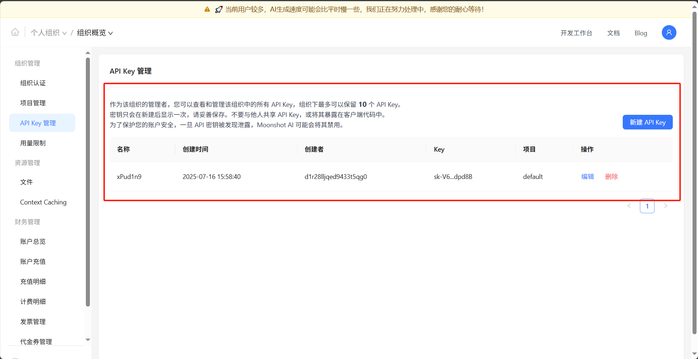

### 1.2 将Moonshot的url和API key设置环境变量

```
ANTHROPIC_API_KEY
你的API key
```

```
ANTHROPIC_BASE_URL
https://api.moonshot.cn/anthropic/
```

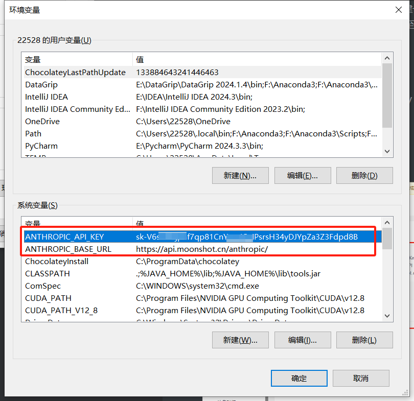


## 2 Claude Code 的安装

​	**Claude Code的最新版本终于支持Windows系统了，不用再用wsl去进行繁琐的配置了！**

```
WSL（Windows Subsystem for Linux）是微软开发的Windows子系统，允许用户在Windows 10/11上原生运行Linux二进制文件，无需虚拟机或双系统启动。
```

在开始之前，需要确保系统满足以下要求：

### 2.1 安装必备组件

- Windows 10 版本 2004 及以上（Build 19041+）或 Windows 11
- 管理员权限
- Git 版本控制工具
- Node.js 18+ 版本（推荐使用最新LTS版本）
- 稳定的网络连接
- 终端功能，比如使用 iTerm2、Windows Terminal 等（非必须）

#### 2.1.1 安装Git

* 下载网址 https://git-scm.com/downloads

**首先，下载windows安装软件，按照提示一步一步进行安装即可**

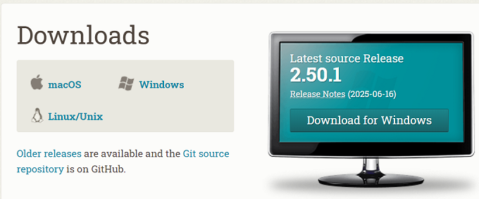

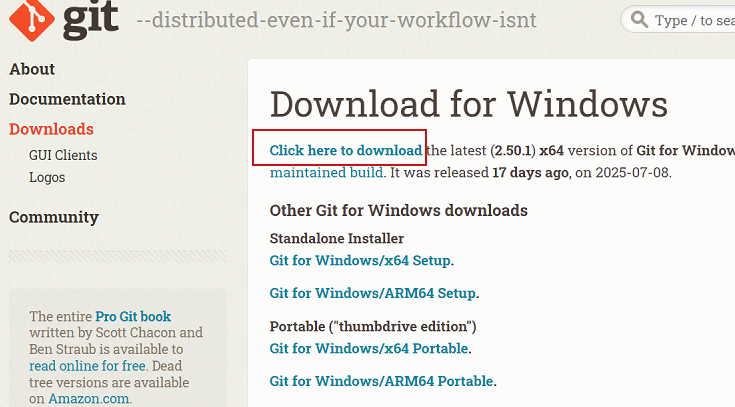

**其次，安装之后，配置环境变量，为了后面Claude Code使用**

```
CLAUDE_CODE_GIT_BASH_PATH

D:\Program Files\Git\bin\bash.exe（git路径）
```

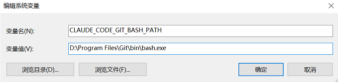

**最后，安装完成后，打开cmd，输入命令，如果看到版本号，证明安装成功**

命令：git --version

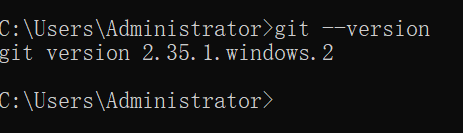


#### 2.1.2  安装 Node.js

下载网址：https://nodejs.org/zh-tw/download/current

**下载Node.js 18+ 版本，安装提示一步一步进行安装**

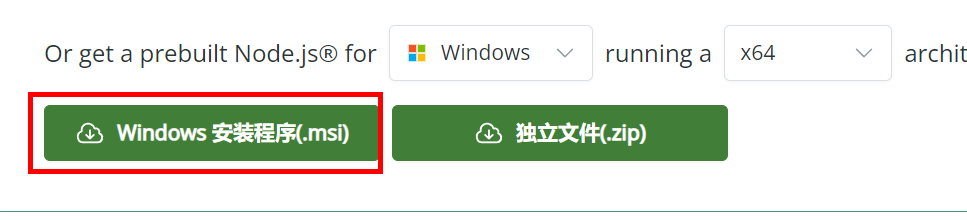

**打开cmd查看版本**

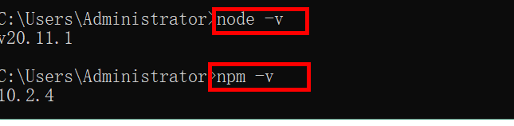


### 2.2 安装claude-code

#### 2.2.1 通过npm包管理器直接安装

```bash
npm install -g @anthropic-ai/claude-code
```

* 安装完成后验证是否安装成功

```bash
claude --version
```

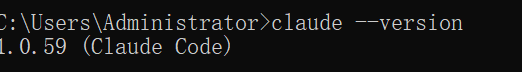


#### 2.2.2 启动网络代理服务

* 在启动之前需要启动一下网络的代理服务，因为如果识别到国内网络环境会禁止登录

* 下载一个VPN软件，开启系统代理
* VPN软件很多，自己可以网上搜索一个，也可以使用推荐的，**根据自己实际情况自行选择**

推荐一个：https://cocoduck.live/auth/register?code=bccad9a4da

比如我的VPN截图，我的端口号是7897

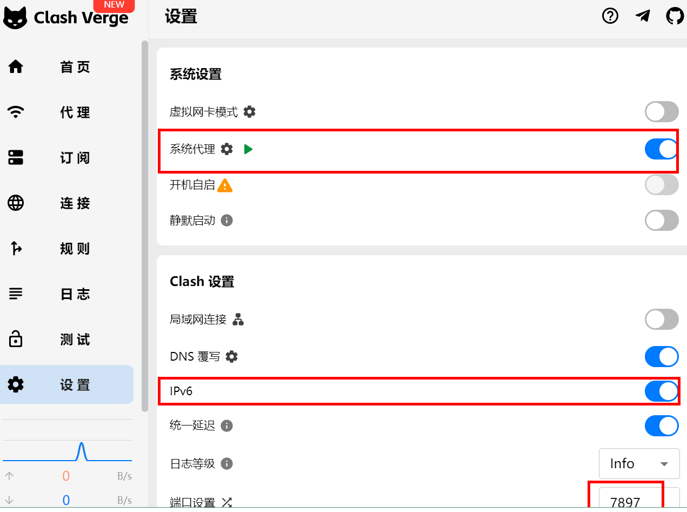

* 在开启代理服务后还需要在当前终端中输入以下配置，我这里是cmd，为让cmd也能使用代理服务。
* 在cmd中直接输入：

```bash
set http_proxy=http://127.0.0.1:7890
set https_proxy=http://127.0.0.1:7890
```


#### 2.2.3 启动Claude Code

**1 启动 Claude Code，强烈建议在项目根目录下使用。**

- 打开CMD仓库，进入到项目目录，然后在命令行输入：`claude` , 我们就可以启动成功的界面内容了。
- 配置主题模式：可以上下切换模式，回车键为确认。


**2 启动 Claude Code后，首先选择颜色配置**

* 根据需要，自行选择

```
注意：如果没有显示下面界面，检查下VPN是否正常
可以在cmd中直接ping www.google.com，查看是否可以ping通
```

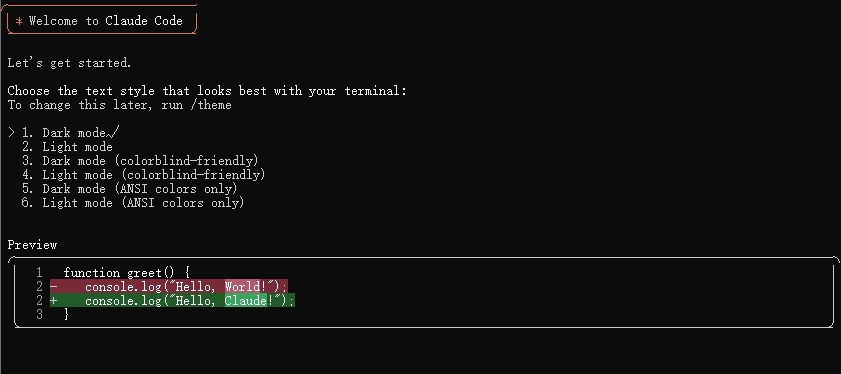


#### 2.2.4 安全配置

> ##### **提示：** 在使用Claude Code的时候，注意审查回复的内容，避免出现注入的风险。 
>
> 接下来我们点击回车键继续。。。

```shell
shell 体验AI代码助手 体验AI代码助手 代码解读 代码解读复制代码╭──────────────────────────╮
│ ✻ Welcome to Claude Code │
╰──────────────────────────╯

 Security notes:

 1. Claude can make mistakes
    You should always review Claude's responses, especially when
    running code.

 2. Due to prompt injection risks, only use it with code you trust
    For more details see:
    https://docs.anthropic.com/s/claude-code-security

 Press Enter to continue…
```


> - **默认选择第一个，然后回车键确认即可。**
> - **上下键可以切换选项，如果是非项目目录，请选择第二个退出**

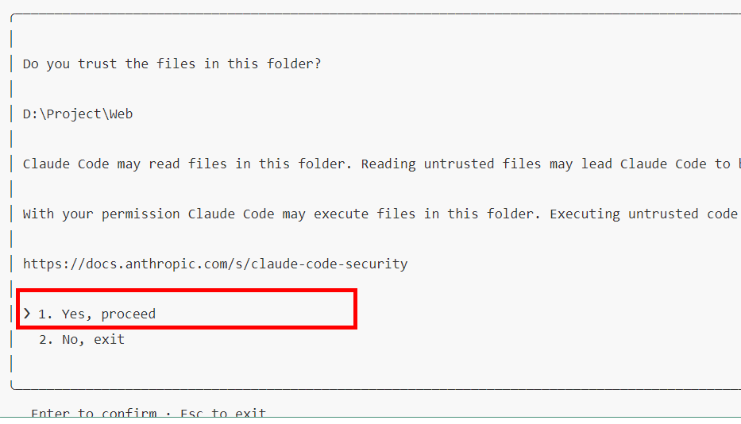


#### 2.2.5 登录

* 登录成功之后，我们可以选择两种计费方式，一种是官方的，一种使用Anthropic控制平台。
* 选择第二种，会自动跳转到官方网站，采用Google方式登录验证即可，同时会自动从环境变量中寻找配置信息登陆进去

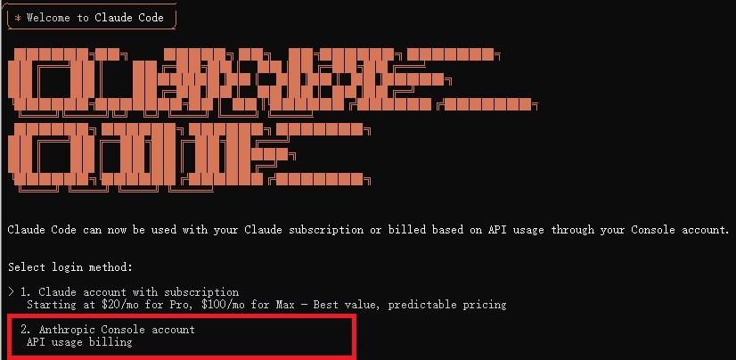

* 选择第二种回车后，会跳转到如下界面，如果没有跳转复制地址到浏览器

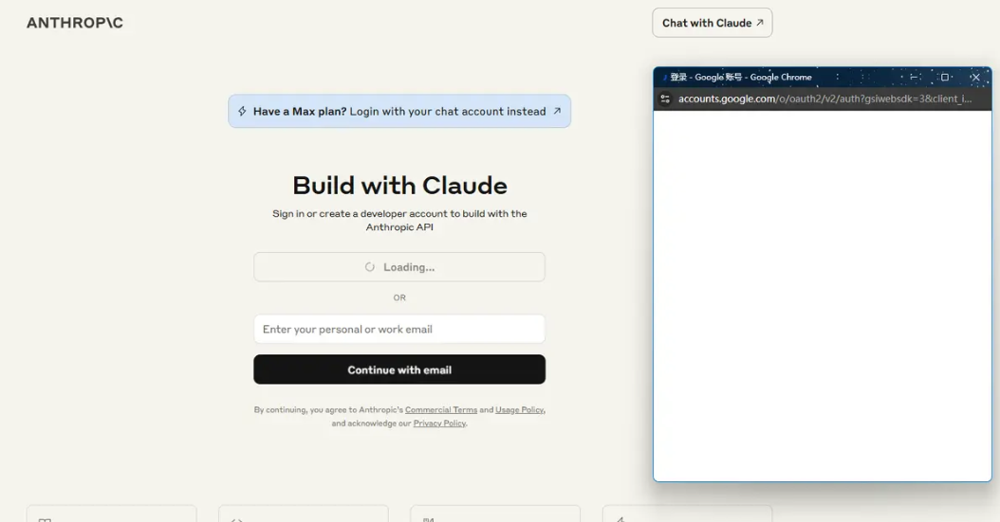

* 选择登录，会弹出一个框，输入谷歌账号登录验证

```
注意：这里需要一个谷歌账号，基本都是使用gmail邮箱，可以自己注册一个，如果不方便注册（因为有个手机验证不好通过），可以购买一个，大约5-10元左右的价格
```

- 下面会出现一串权限的Code，需要复制到命令行工具里面去。

```
注意：有的时候不需要复制，直接谷歌账号验证通过就可以了，我在安装时候就没有复制就安装成功了。
根据实际情况酌情操作
```

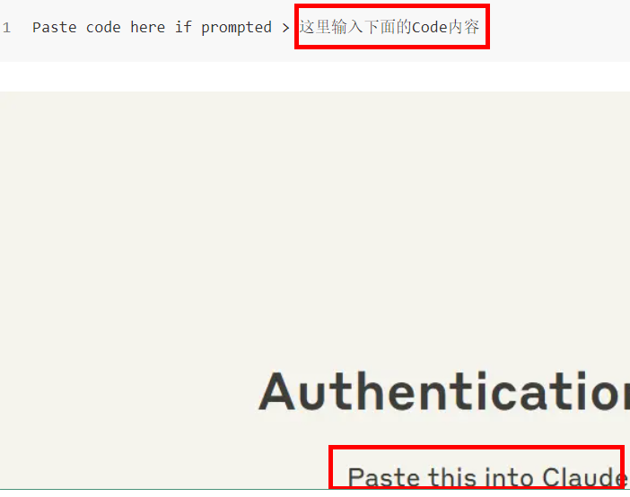


* 之后正常来说就可以进行使用了

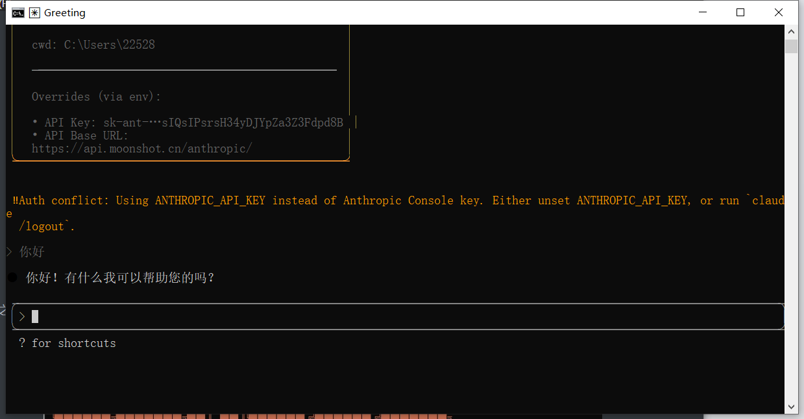

​	如果这里显示并发数限制之类的**Error 429**报错，则是Kimi那边的问题。Kimi给每个用户提供了15元的免费额度，但是免费用户的并发数限制为1，这很可能导致不能正常使用。需要至少充值50元让用户等级从**free**到**Tier1**就可以解决这个问题。

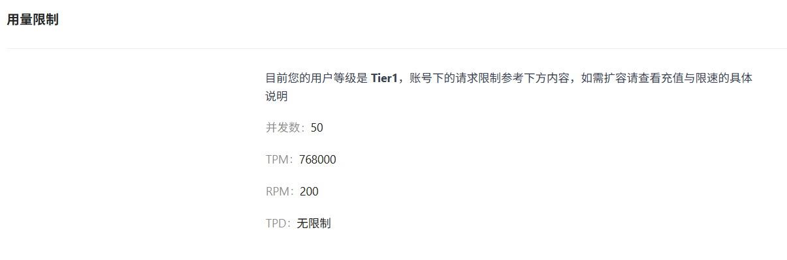

